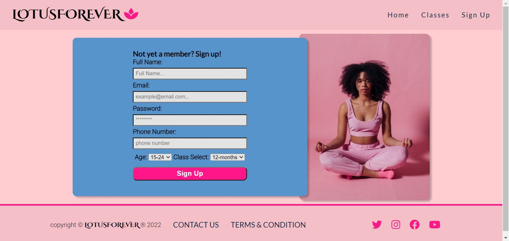

# Readme file for LOTUSFOREVER yoga website

Lotusforever Yoga 
The lotusforever yoga website is a website for anyone aged 15 and above that finds the practice of yoga relaxing and calming. The website offers easy streaming and couching of yoga positions that clients can stream directly to the comfort of their homes without the hasles of meeting up at venues 

Users of the website will easily find the information they need to register and access our ever growing libray of online yoga practice with first class facilitators guiding them tru each rewardsing practice of yoga. 

We believe your time is precious and how you plan it matters a lot to you so we offer you the option to stream at any convenient time.

## Features:

**Navigation:**

1.	The name of the website is displayed on the top left corner this also links users to the top of the page. It is fixed and allows all other content to scroll under it offering the user a more flexible and prominent option to refresh page back to the top as needed.
2.	To the right is the other navigation links arranged in order: Home, Classes and Sign-Up. This links offer connection to different sections of the page and different pages of the site.

3. The hero image displays a set of motivational quotes to inspire and motivate users.   

4. Underneat the hero text display is the links to the companys social sites. Users can easily access these external site on desktops or mobile to continue their calming yoga journey. 

 **About us section:**

1. The About section explains in detail the site goal and what users are to expect while registering on the site.
**Gallery**

2. The mini gallery display scrolls horizontally and offers site user a sneak peak at some select classes.

**Class select**

Beneath the mini gallery is the pick a class section. The classes are broken down into months. users can pick class durations that best suits them. Each contains links that will allow the site user to sign up.

**Tutors:**

Site users are offered to a portal to view the tutors page (feature not available as at time of write up)

**Sign Up page:**

The sign up form collects data off users who sign up. Data collected include full name, email, password phone number, age and the class duration of choice. wrong inputs or unfilled segments have been addressed using `required` attributes. 

**Footer:**

1. The footer contains link to the sites contat-us page and terms and condition page. 

2. It also contains another set of the sites social links. This is convinently placed to allow users the ease of not scrolling back up to the ones on top.

3. Contact us link opens a contact query and enquires page where site users can lodge complaints or easily make enquires. It is a simple form with texts areas and brief detail of name and email address. It also contains the company address, phone number and email. 

**Terms and condition:**

The company’s terms and condition page is available through the link at the footer and opens in a new page for ease of read and reference by site users and members signed up.

## Testing:
I tested that the page works in different browsers chrome, moxila firefox and  Microsoft edge 

Responsiveness test on each web browser was done using the developer device tool bar.

I have confirmed that the form works well and required entry in each field will only accept designated inputs.

I have confirmed that all links work perfectly and all navigation elements are easy to read and understand.

## Bugs: 

## Validator Testing 
**HTML**

No errors were returned when passing through the official W3C validator.

**CSS**

No errors were returned when passing through the official (jigsaw) validator.

**Accessibility**

I confirmed that the fonts and colors selected are easy to read and assecible by running it through light house in devtools.

**Unfixed bugs:** 

none

## Deployment 

The site was deployed to github 
1.	In the github repository click on the setting tab 
2.	Navigate to the github pages section and click on the dedicated pages tab
3.	On the source tab select main and save
4.	Once the branch main is saved the page displays a link to the website.
5.	Refresh the browser and a `Your site is published at` display with the site link appears. 
The live site can be found here  [Lotusforever](https://samuelukachukwu.github.io/lotusforever-yoga-website/)

## Credits
**Yoga youtube site:**  
[Boho Beautiful Yoga](https://www.youtube.com/channel/UCWN2FPlvg9r-LnUyepH9IaQ) 

**Image used in website:**

1.  [SHVETS production](https://www.pexels.com/@shvets-production)
2.	[Alexy Almond](https://www.pexels.com/@alexy-almond)
3.	[KoolShooters](https://www.pexels.com/@kool-shooters )
4.	[PNW Production](https://www.pexels.com/@pnw-prod)
5.	[Miriam Alonso](https://www.pexels.com/@miriam-alonso)
6.	[Spencer Selover](https://www.pexels.com/@spencer-selover-142259)

Site terms and conditions generated using: [Termly](https://app.termly.io/)
**inserted codes:**

[Code Institute](https://codeinstitute.net/)

[W3School](https://www.w3schools.com/)

 [John_C](https://stackoverflow.com/users/1588990/john-c?tab=profile) for codes in horizontal scrolling div.

[Web-tiki](https://stackoverflow.com/users/1811992/web-tiki) for codes in div height not expanding.

